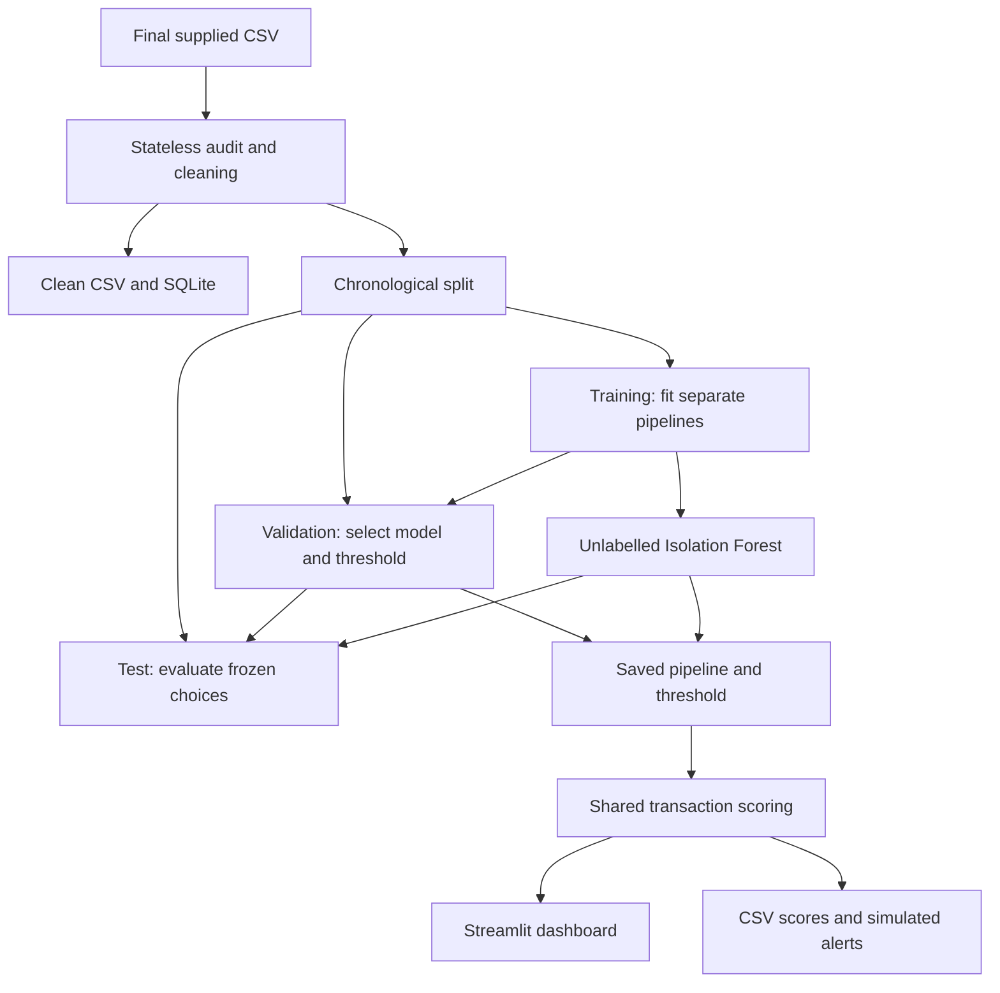
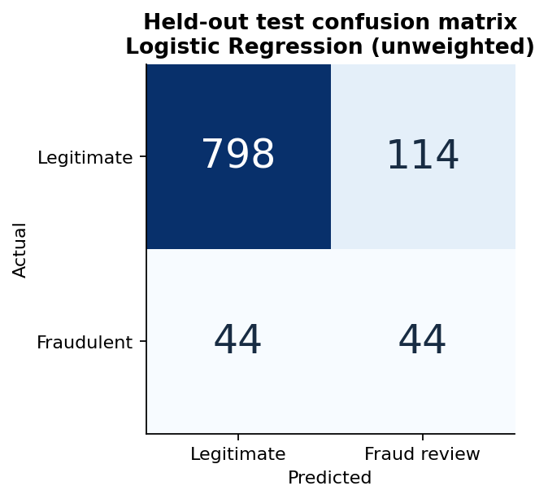
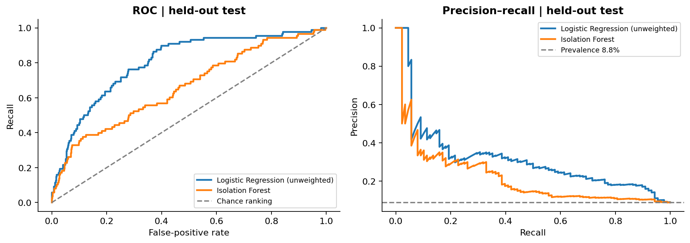

# Financial Fraud Detection Model with Dashboard

An original **Zidio data science project** by **Jairus Omondi**: reproducible SQLite ETL,
supervised fraud screening, Isolation Forest anomaly detection and a six-page Streamlit
dashboard. Every result comes from the supplied final 5,000-row CSV.

**Repository:** [jairus011/financial-fraud-detection-dashboard](https://github.com/jairus011/financial-fraud-detection-dashboard).

**Educational prototype for human review.** Model alerts are not confirmed fraud findings.
The observed performance does not support automatic payment blocking or a production-readiness claim.

## Objectives

- Audit and clean the supplied data without mixing reference-notebook datasets or outputs.
- Compare suitable supervised classifiers using fraud-sensitive metrics and a fixed temporal split.
- Add an independently fitted unsupervised detector and a lightweight alert simulation.
- Save the complete preprocessing/model pipelines and portable scored outputs.
- Explain the data, model tradeoffs and limitations through an interactive dashboard.

## Quick start

Use **Python 3.12** and run commands from this repository's root. The committed models and
scored outputs let you open the dashboard immediately after installing requirements.

Clone the repository using a GitHub account with access, or extract the supplied project ZIP:

```bash
git clone https://github.com/jairus011/financial-fraud-detection-dashboard.git
cd financial-fraud-detection-dashboard
```

### Windows PowerShell

```powershell
py -3.12 -m venv .venv
.\.venv\Scripts\python.exe -m pip install -r requirements.txt
.\.venv\Scripts\python.exe -m streamlit run app.py
```

These commands do not require changing your PowerShell execution policy.

### Linux / macOS

```bash
python3.12 -m venv .venv
.venv/bin/python -m pip install -r requirements.txt
.venv/bin/python -m streamlit run app.py
```

Open the localhost URL printed by Streamlit (normally port 8501). The portable launch
command, with the project environment active, is:

```bash
python -m streamlit run app.py
```

### Online hosting

The app is prepared for a Render Free web service using Python 3.12 and
`python scripts/start_dashboard.py`. It uses the host's `PORT` and the committed
model artifacts. See [deployment settings](docs/deployment.md) for the exact build
command, hosting behavior and final live-verification steps. A live URL will be
added after the deployment succeeds.

### Rebuild and verify everything

Use the same environment's Python executable for these commands:

```bash
python -m src.train
python -m pytest
python scripts/verify_fresh_run.py
python scripts/verify_launch.py
python scripts/execute_notebook.py
```

`src.train` rebuilds cleaned data, SQLite, all model comparisons, saved artifacts, scores,
alerts and report figures. The final notebook also calls that same pipeline, so its results
cannot silently drift from the app. The notebook executor runs cells in a fresh IPython
process and preserves real rich outputs; add `--kernel` to use a normal Jupyter kernel on
a host with local network sockets. You can also open the notebook in VS Code/Jupyter and Run All.

`verify_fresh_run.py` creates an empty temporary output folder, retrains every model, and
checks that metrics and serialized predictions reproduce before cleaning up its temporary files.

## Dataset and features

The only dataset is `data/raw/financial_fraud_detection_dataset.csv`, an unchanged copy of
the uploaded `financial_fraud_detection_dataset(2).csv`. The reference notebook uses another
schema and contributes no final metrics. See the [reference audit](docs/reference_notebook_audit.md).

| Dataset fact | Actual value |
|---|---:|
| Transactions / columns | 5,000 / 14 |
| Fraudulent / legitimate | 482 / 4,518 |
| Fraud rate | 9.64% |
| Unique customer IDs | 3,847 |
| Total transaction amount | 395,903.32 dataset units |
| Amount in fraud-labelled transactions | 39,520.96 dataset units |
| Missing values / exact duplicate rows | 0 / 0 |
| Date range | 2023-01-01 to 2024-02-21 |

**Currency, source timezone, provenance, label-generation rules and a dataset licence were
not supplied.** Amounts are not presented as a verified loss estimate or a named currency.
The dataset must not be described as validated live-bank data or given a redistribution
licence that the source did not provide.

All 14 actual columns and their roles are documented in [data/README.md](data/README.md).
The final model consumes exactly:

| Input column | Processing |
|---|---|
| `Transaction_Date` | Day-first or ISO parsing; cyclic hour/weekday and weekend features |
| `Transaction_Amount` | Numeric amount and log(1 + amount) |
| `Is_International` | Binary numeric input |
| `Merchant_Category` | One-hot encoding |
| `Payment_Method` | One-hot encoding |
| `Device_Type` | One-hot encoding |
| `Location` | One-hot encoding |

`Transaction_ID` and `Customer_ID` are retained only for audit and traceability.
`Fraudulent` is the outcome, never an input. `Suspicious_Keyword` is excluded because its
creation timing is unknown. The three supplied history fields are also excluded:
the time-sorted customer audit found **606 decreases in account age** and **572 decreases
in previous-transaction count**. History and keyword variants are validation-only sensitivity
experiments; neither can replace the final artifact.

## Architecture and workflow



The database stores cleaned observations; it does not fit global imputers or scalers.
Every estimator owns its feature transformer, imputer and encoder. `src.predict` loads
the same fitted pipeline used for evaluation. The app never reimplements the model's
preprocessing and never accepts an uploaded executable model file.

## Preprocessing and feature engineering

- Validate the exact supplied schema and dataset SHA-256; reject accidental dataset changes.
- Trim strings, parse explicit day-first/ISO timestamps, validate labels and keys, remove exact duplicates.
- Reject conflicting transaction IDs; account for invalid dates/keys/labels in the audit.
- Retain valid extreme and zero amounts. Optional invalid numeric cells become missing.
- Learn numeric medians and categorical handling only on training rows. Prediction-time blanks
  and unseen categories are supported; invalid dates, negative values and missing columns receive errors.
- Add amount log transform and cyclic hour/weekday features. No future rows are used to build features.
- Apply standard scaling for Logistic Regression and Isolation Forest; trees need no normalization.

No PCA is used. No SMOTE is used: class-weighted and unweighted training are directly
compared, and extra synthetic observations are unnecessary for this benchmark.

## Supervised and unsupervised models

| Method | Main fixed settings |
|---|---|
| Logistic Regression | C=1, maximum 2,000 iterations; weighted/unweighted |
| Decision Tree | Maximum depth 5, minimum leaf 25; weighted/unweighted |
| Random Forest | 250 trees, maximum depth 10, minimum leaf 8; weighted/unweighted |
| Histogram Gradient Boosting | 160 iterations, learning rate 0.06, 15 leaves, L2=2; weighted/unweighted |
| Isolation Forest | 250 trees, 256-row subsamples; fitted without labels |
| Dummy prior | Constant training prevalence; no fraud alerts at threshold 0.5 |

Histogram gradient boosting is the suitable gradient-boosting alternative to XGBoost.
Isolation Forest's threshold is the training 90th percentile of anomaly scores: a
prespecified 10% review-budget assumption, not an estimate of the fraud rate. Labels are
used only for anomaly-detector evaluation. Anomaly scores mean unusualness, not fraud probability.
One-Class SVM and autoencoders are intentionally deferred pending a useful comparison case.

## Evaluation methodology

Read the full [fixed evaluation protocol](docs/evaluation_protocol.md).

| Partition | Rows | Frauds | Date interval |
|---|---:|---:|---|
| Train | 3,000 | 286 | 2023-01-01 02:16 to 2023-09-11 02:42 |
| Validation | 1,000 | 108 | 2023-09-11 05:17 to 2023-11-29 01:11 |
| Test | 1,000 | 88 | 2023-11-29 03:08 to 2024-02-21 15:34 |

All models use the same split. Equal timestamps remain together. Returning customers may
appear in multiple partitions, but IDs are excluded from features. The test contains 257
transactions from customers seen in training and 743 from previously unseen customers;
both slices are disclosed in `outputs/metrics.json`.

**Model selection:** highest validation average precision (AP). **Decision threshold:**
maximum validation F1, with ties favouring recall. Model and threshold are frozen before
test evaluation. The committed artifact remains the exact train-only fitted pipeline used
for that evaluation. Full-dataset scores contain in-sample training rows and must not be
used to report generalization performance.

## Final model and actual metrics

**Selected: unweighted Logistic Regression.** Validation AP: **0.3947**.
Frozen fraud-review threshold: **0.1590613181**.

| Test metric | Result |
|---|---:|
| Precision | 27.85% |
| Recall | 50.00% |
| F1-score | 0.3577 |
| ROC-AUC | 0.8019 |
| Average precision (AP; primary PR summary) | 0.3157 |
| PR-AUC (trapezoidal) | 0.3119 |
| Test fraud prevalence | 8.80% |
| True negatives / false positives | 798 / 114 |
| False negatives / true positives | 44 / 44 |

The model flags 158 test transactions, detects 44 of 88 frauds, and raises 114 false alerts.
This result is reported honestly; accuracy is not used to disguise missed fraud.
Isolation Forest achieves precision 0.2959, recall 0.3295, F1 0.3118, ROC-AUC 0.6600,
AP 0.2203 and PR-AUC 0.2160 on the same test set.

The [project report](reports/project_report.md) contains the complete ten-method comparison.
Machine-readable results are in [model_comparison.csv](outputs/model_comparison.csv) and
[metrics.json](outputs/metrics.json). All seven requested evaluation quantities, including
confusion-matrix counts, are provided for every candidate.

AP and trapezoidal PR-AUC are distinct. The constant-score dummy has AP 0.0880; its
trapezoidal PR-AUC of 0.5440 is an interpolation artefact, not evidence of model quality.
The 400-repeat customer-group bootstrap gives conditional 95% test AP bounds of 0.2311–0.4053.
Other intervals and group-slice results are included in the metrics file.




## Dashboard pages

| Page | Main features |
|---|---|
| Executive Overview | Six transaction KPIs, monthly activity, merchant fraud exposure and fixed test metrics |
| Fraud Analysis | Category/location/device/payment/international counts, rates and amount comparison |
| Transaction Patterns | Daily/weekly/monthly trends and hour-by-weekday heatmap |
| Risk/Anomaly Analysis | Score distributions, review queue, signal overlap, scored CSV export and simulated alerts |
| Model Performance | Confusion matrix, model table, ROC/PR curves, validation threshold explorer and audit details |
| Transaction Prediction | Seven-field form, batch CSV upload, input template and downloadable predictions |

Date, location, device, merchant and partition filters apply to the four analysis pages.
Test metrics always remain tied to the fixed test set. Observed labels, predicted review
flags and anomaly flags are visually labelled as different concepts. Scores are not
calibrated probabilities. The dashboard never claims to be live fraud monitoring.

### Dashboard screenshots

The implementation environment passed all six Streamlit page tests and a real HTTP launch
check, but its browser cannot access the isolated local server (`ERR_BLOCKED_BY_CLIENT`).
Consequently, browser screenshots have **not** been claimed or fabricated. The images above
are actual generated evaluation figures, not screenshots.

To complete screenshot documentation on a machine that can open the dashboard, launch it
and capture Executive Overview, Model Performance and a submitted Transaction Prediction.
Save those captures under `outputs/screenshots/` and embed them here. The exact remaining
capture status is documented in [outputs/screenshots/README.md](outputs/screenshots/README.md).

## Batch scoring, ETL and alert simulation

```bash
# ETL only
python -m src.data

# Score supplied rows using the committed model and threshold
python -m src.predict --input data/prediction_example.csv --output outputs/batch_predictions.csv

# Create up to 25 simulated alerts from held-out test predictions
python -m src.alerts --input outputs/test_predictions.csv --output outputs/fraud_alerts.jsonl --limit 25
```

The alert JSONL contains `SIMULATED_ONLY` human-review requests. No email, API keys,
passwords or external notifications are required. The UI offers the same simulation for
its current filtered view. This is an offline batch demonstration, not Kafka/Spark ingestion.

## Repository structure

| Path | Contents |
|---|---|
| `app.py` | Streamlit dashboard and prediction interface |
| `requirements.txt` | Exact tested direct dependency versions |
| `.gitignore` | Secrets, environments, caches and temporary files excluded |
| `.streamlit/config.toml` | Dashboard theme and local server defaults |
| `.python-version` | Python 3.12 selection for hosting |
| `src/` | Data audit/ETL, feature pipeline, model training, evaluation, prediction, alerts and figures |
| `data/raw/` | Only the supplied final CSV |
| `data/processed/` | Clean CSV and indexed SQLite database |
| `data/prediction_example.csv` | Portable seven-column batch input example |
| `notebooks/financial_fraud_detection_final.ipynb` | Original executed end-to-end notebook |
| `models/` | Fraud and anomaly pipeline bundles, frozen selection and SHA-256 manifest |
| `outputs/` | Audit, split assignments, metrics, diagnostics, scores, curves and simulated alerts |
| `outputs/figures/` | Seven generated analysis/evaluation figures |
| `outputs/screenshots/` | Screenshot capture status and instructions |
| `reports/project_report.md` | Concise technical project report with actual results |
| `docs/` | Original specification, evaluation protocol and reference-notebook audit |
| `scripts/` | Notebook generation/execution, empty-folder reproduction and server launch checks |
| `tests/` | Data/leakage/prediction/SQLite/metric checks and six-page dashboard tests |
| `.github/workflows/ci.yml` | Python 3.12 install, tests, reproduction, launch and notebook checks |

The small dataset, final notebook, selected model artifacts and key outputs are deliberately
versioned for an immediately runnable submission. No virtual environments, caches or secrets
belong in the repository. `joblib` bundles use pickle internally: load only trusted artifacts
with the pinned scikit-learn version and the `src` package available. A `.pkl` extension is
not required; these `.joblib` bundles are the saved models.

## Verification

- 26 automated tests pass, including every page, prediction form, filters and alert simulation.
- A complete empty-output-folder rebuild reproduces the selected model, metrics and saved scores.
- All 13 notebook code cells execute in a fresh IPython process without errors.
- A real Streamlit server launches and its health endpoint responds HTTP 200 / `ok`.
- `python -m pip check` reports no broken requirements.
- Screenshot capture remains limited by the isolated browser preview connection.

Read [verification.json](outputs/verification.json) for the recorded status.
The [GitHub Actions validation run](https://github.com/jairus011/financial-fraud-detection-dashboard/actions/runs/35002256087)
**passed** on the uploaded project: clean dependency installation, automated tests, real
Streamlit launch, full output rebuild and notebook execution. All 59 published files were
verified against the local Git blob hashes, and the repository was opened in a browser.
The repository is private; assessors need repository access to review it.

## Limitations and future enhancements

The sample's provenance and label process are unknown; historical features are inconsistent.
One temporal holdout with only 88 frauds cannot establish institution-wide performance.
Customer overlap and time variation remain relevant, despite excluding IDs. Scores have
not been calibrated. No costs or review-capacity policy were supplied, so the F1 threshold
is only a demo operating point. Feature associations do not establish causes or fairness.

Next priorities are verified point-in-time history, better source/label documentation,
more representative data, rolling/external validation, calibration and review-cost thresholds.
Kafka/Spark streaming, graph fraud networks, real email delivery, adaptive retraining and
mobile integration are future work. Credit scoring and blockchain prevention are separate
extensions, not completed fraud-detection capabilities.

## Sources

- Supplied final CSV and project specification (preserved in `data/` and `docs/`).
- [scikit-learn leakage and preprocessing guidance](https://scikit-learn.org/stable/common_pitfalls.html)
- [scikit-learn average precision definition](https://scikit-learn.org/stable/modules/generated/sklearn.metrics.average_precision_score.html)
- [Streamlit application testing](https://docs.streamlit.io/develop/api-reference/app-testing/st.testing.v1.apptest)
