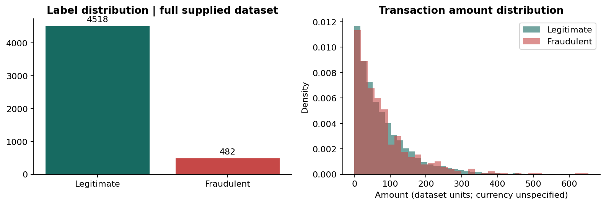

# Financial Fraud Detection Model with Dashboard

**Zidio final project — Jairus Omondi**

## Problem and objective

Fraud screening must identify suspicious transactions while making the cost of false alerts
and missed fraud visible. This project builds a reproducible transaction-level classification
and anomaly-detection workflow, a local SQLite ETL layer, saved model pipelines and a
Streamlit dashboard for analysis and human review. The deliverable is an educational
prototype; it does not establish readiness for live payment blocking.

## Dataset and source audit

The sole source is the supplied `financial_fraud_detection_dataset(2).csv`, renamed to
`data/raw/financial_fraud_detection_dataset.csv` without changing its bytes. Its SHA-256 is
recorded in `outputs/data_audit.json` and checked before training. The source contains
5,000 transactions, 14 columns, 3,847 customer IDs and 482 fraud labels (9.64%). Dates run
from 1 January 2023 to 21 February 2024. Total transaction amount is 395,903.32, of which
39,520.96 belongs to fraud-labelled transactions. Amounts are expressed in unspecified
dataset units; these figures must not be labelled dollars, rupees or verified losses.

There are no missing cells, exact duplicates or invalid dates in the supplied file.
All 5,000 rows are retained, including two zero-amount transactions. No source URL, currency,
timezone, labelling procedure, licence or confirmation of real/synthetic provenance was supplied.

The reference notebook loads a different dataset and uses a different target/schema.
It resamples before splitting and compares models on inconsistent test fractions.
None of its outputs are reused. The detailed comparison is in
`docs/reference_notebook_audit.md`; the supplied text specification is preserved in `docs/`.

## Cleaning, ETL and leakage controls

ETL trims text, validates schema and labels, parses explicit day-first timestamps and
checks transaction-ID uniqueness. Invalid optional numeric inputs become missing and
are handled by the later training-fitted imputer. Conflicting transaction IDs trigger an
error. Valid extreme amounts are retained to avoid deleting the very signal being modelled.
The cleaned CSV and SQLite `transactions` table contain the same 5,000 records; the database
has indexes for transaction ID and time. Row count and amount totals are tested.

Two IDs and the outcome are never predictors. `Suspicious_Keyword` is excluded because its
creation time relative to investigation is unknown. The audit also found 606 decreases in
account age and 572 decreases in previous-transaction count within time-sorted customer IDs.
The supplied history fields therefore remain excluded from the final model. These findings
indicate unresolved source semantics; they do not prove intentional leakage or explain how
the dataset was generated. No cross-customer or future-row aggregates are invented.

## Feature engineering and exploratory analysis

The final model uses amount, transaction date/time, international status, merchant category,
payment method, device type and location. It adds log(1 + amount), cyclic hour and weekday
features and a weekend indicator. These transformations depend only on the transaction.
Numeric median imputation and categorical imputation/one-hot encoding are inside each
estimator's pipeline. Unknown categories are supported. Standard scaling is used for
Logistic Regression and Isolation Forest, while tree classifiers use unscaled numeric values.

Exploration covers label balance, amount distributions, merchant/device/payment/location
counts and fraud rates with denominators, monthly activity, and hour-by-weekday heatmaps.
Training-only correlation and validation permutation importance support model interpretation.
Full-dataset charts are clearly descriptive; they are not presented as held-out performance.
PCA is not included because this small mixed-feature dataset has interpretable native views
and no established need for a learned projection.

## Evaluation design

The protocol was fixed before fitting models. Chronological partitions approximate screening
later transactions. Equal boundary timestamps are kept together, and the same IDs are used
for every candidate. Train has 3,000 rows/286 frauds, validation has 1,000/108, and test has
1,000/88. Training ends on 11 September 2023; validation ends on 29 November 2023; the test
period begins later on 29 November and ends on 21 February 2024.

Imputers, encoders, scalers and estimators are fitted only on training rows. Class weights
are compared with unweighted fitting; no SMOTE or other resampling is used. The primary
selection metric is validation average precision (AP). The selected model's decision
threshold maximizes validation F1, with ties favouring recall. Both are frozen before the
test comparison. The persisted model is the exact train-only fit evaluated on test; there
is no silent train-plus-test refit. Accuracy is not a headline metric.

AP and trapezoidal PR-AUC are reported separately. The dummy-prior AP equals the test
prevalence, 0.088. Trapezoidal PR-AUC is misleading for that constant-score baseline because
linear interpolation spans sparse endpoints; AP is used for model selection.

## Models and actual results

Logistic Regression, a depth-constrained Decision Tree, Random Forest and histogram gradient
boosting are each fitted with and without class weights. Histogram gradient boosting provides
the requested boosting comparison without an XGBoost dependency. Settings are deliberately
small and fixed. Isolation Forest is fitted without labels to all training features; its
cutoff is the training 90th percentile, a prespecified 10% review-budget assumption.
One-Class SVM and neural autoencoders are deferred because their extra cost has no demonstrated
benefit for this benchmark.

| Model | Test precision | Recall | F1 | ROC-AUC | AP | PR-AUC |
|---|---:|---:|---:|---:|---:|---:|
| **Logistic Regression, unweighted — selected** | **0.2785** | **0.5000** | **0.3577** | **0.8019** | **0.3157** | **0.3119** |
| Logistic Regression, balanced | 0.3015 | 0.4659 | 0.3661 | 0.7972 | 0.3094 | 0.3056 |
| Decision Tree, unweighted | 0.2474 | 0.8182 | 0.3799 | 0.8222 | 0.2797 | 0.3058 |
| Decision Tree, balanced | 0.2517 | 0.8523 | 0.3886 | 0.8246 | 0.2778 | 0.3056 |
| Random Forest, unweighted | 0.2564 | 0.6818 | 0.3727 | 0.8248 | 0.3126 | 0.3068 |
| Random Forest, balanced | 0.2519 | 0.7386 | 0.3757 | 0.8239 | 0.3150 | 0.3102 |
| Histogram Gradient Boosting, unweighted | 0.2357 | 0.7500 | 0.3587 | 0.8148 | 0.2655 | 0.2593 |
| Histogram Gradient Boosting, balanced | 0.2325 | 0.6023 | 0.3354 | 0.8038 | 0.2816 | 0.2771 |
| Isolation Forest | 0.2959 | 0.3295 | 0.3118 | 0.6600 | 0.2203 | 0.2160 |
| Dummy prior / no fraud alerts | 0.0000 | 0.0000 | 0.0000 | 0.5000 | 0.0880 | 0.5440* |

*The dummy's trapezoidal value is an interpolation artefact, not evidence of useful detection.*

The selected unweighted Logistic Regression achieved the highest validation AP, 0.3947.
Its frozen score threshold is 0.1590613181. On test, it flags 158 transactions: 44 true frauds
and 114 false alerts. It misses 44 frauds and correctly leaves 798 legitimate transactions
unflagged. Although some alternatives show higher test F1 or ROC-AUC, the choice is retained
because selection must not be changed after inspecting test results.

A 400-repeat customer-group test bootstrap gives conditional 95% intervals of 0.2050–0.3495
for precision, 0.3960–0.5914 for recall, 0.2751–0.4300 for F1 and 0.2311–0.4053 for AP.
These do not capture retraining/model-selection uncertainty. The test contains 257 transactions
from customers seen in training and 743 from unseen customers; these slices are reported
separately in `outputs/metrics.json`. IDs themselves cannot affect predictions.

Validation-only diagnostics add history or the suspicious-keyword field to the chosen
architecture. AP is 0.3744 with history and 0.4696 with the keyword, compared with 0.3947
for the final transaction-only feature set. Neither diagnostic replaces the conservative
artifact or resolves source provenance.

## Dashboard and reusable outputs

The Streamlit application provides six pages: Executive Overview, Fraud Analysis,
Transaction Patterns, Risk/Anomaly Analysis, Model Performance and Transaction Prediction.
Date, partition, merchant, device and location filters control descriptive views. KPIs
include counts, observed fraud rate, total/fraud-labelled amounts and model review flags.
The performance page always uses the fixed test period. A validation-only threshold explorer
shows tradeoffs without changing the deployed threshold or test figures.

Single-transaction and CSV prediction call the same saved pipeline as training. The input
template contains only the seven supported fields. Anomaly scores, supervised scores,
review flags, actual labels and evaluation partitions remain distinct. The local alert
simulation writes up to 25 high-risk test transactions to JSONL for demonstration, sending
no messages and requiring no credentials. It requests human review rather than confirming fraud.

Saved outputs include both joblib bundles, selection metadata, artifact/dataset hashes,
clean CSV/SQLite data, split assignments, model comparison tables, test/full scored outputs,
threshold curves, seven report figures, diagnostics and the executed final notebook.

## Limitations and future work

The model has moderate ranking value, limited recall and many false alerts. It is not
calibrated and should not automatically approve or block transactions. Only one supplied
sample and one temporal holdout are available, with 88 test frauds and unresolved history
semantics. The study does not establish causal feature effects, fairness, regulatory
compliance, real financial savings or deployment performance in a new institution.

Priority improvements are source/label documentation, reliable point-in-time histories,
more representative data, rolling and external validation, calibrated probabilities and
thresholds based on fraud loss and review capacity. Kafka/Spark streaming, graph networks,
real notification delivery, adaptive learning, mobile integration, credit scoring and
blockchain remain future enhancements. The present implementation is an offline ETL,
batch-scoring and review-simulation system.

## Method references

- [scikit-learn: common pitfalls and leakage](https://scikit-learn.org/stable/common_pitfalls.html)
- [scikit-learn: average precision](https://scikit-learn.org/stable/modules/generated/sklearn.metrics.average_precision_score.html)
- [Streamlit: application testing](https://docs.streamlit.io/develop/api-reference/app-testing/st.testing.v1.apptest)

Read `README.md` for installation and `outputs/verification.json` for recorded verification
status. The original specification, source audit, protocol and all actual numeric results
are included for independent review.
